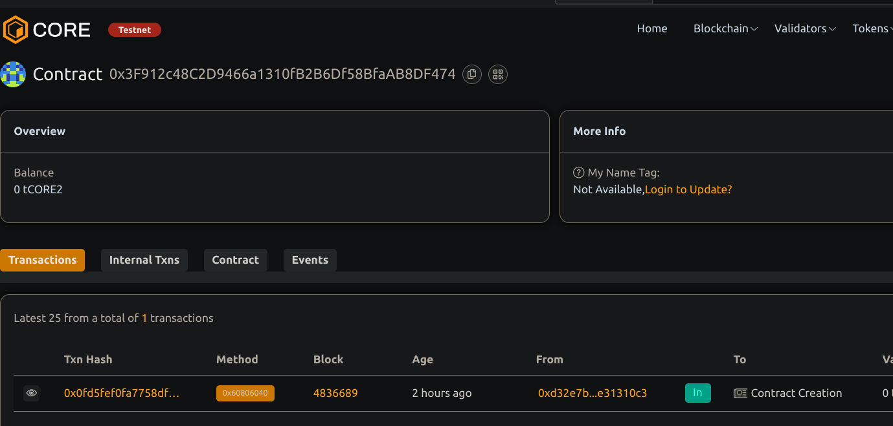

# DocumentVerificationSystem

## Project Description
DocumentVerificationSystem is a smart contract that enables secure on-chain verification of documents via their hash signatures. Uploaders can register document hashes, and authorized verifiers can mark documents as verified, ensuring immutability and transparency.

## Project Vision
To build a decentralized and tamper-proof system for document authenticity verification, reducing fraud and increasing trust in digital document handling .

## Key Features
- Upload document hashes securely on-chain
- Owner-only verification process for document authenticity
- Publicly accessible verification status for any document hash and document validation
- Event logs for all uploads and verifications, ensuring auditability

## Future Scope
- Role-based verification for multiple verifiers . 
- Support for document revocation or update with new hashes .
- Integration with IPFS or other decentralized storage solutions .
- Frontend interface for easy document upload and verification status checks and retracing document .

## Contract details 
0x3F912c48C2D9466a1310fB2B6Df58BfaAB8DF474
